# Uso de Particle Swarm Optimization na Otimização de Hiperparâmetros de Redes Neurais para Classificação Binária da Doença de Parkinson por Análise de Voz
Foi desenvolvido uma aplicação para a otimização de hiperparâmetros baseado em PSO para classificação binária de DP a partir de caracteristicas vocais. A otimização seguiu uma abordagem modular, implementando componentes independentes para cada etapa do pipeline de processamento: carregamento de dados, construção de modelos, otimização PSO, gerenciamento de banco de dados e avaliação final. Todas as configurações utilizadas foram centralizadas para facilitar a parametrização.

O dataset utilizado compreende 1.195 registros vocais, dos quais 195 correspondem a gravações reais de fonação sustentada e 1.000 a dados sintéticos. Seguindo as práticas estabelecidas na literatura, apenas os dados reais foram utilizados, resultando em 195 amostras: 147 de pacientes com DP (75,4\%) e 48 de controles saudáveis (24,6\%).

- [link para o dataset](https://www.kaggle.com/datasets/shreyadutta1116/parkinsons-disease)

Cada registro vocal foi caracterizado por 22 características acústicas categorizadas em cinco grupos:

| Caracteristica | Atributo | Descrição |
|---|---|----|
| Frequência Fundamental| MDVP:Fo(Hz), MDVP:Fhi(Hz), MDVP:Flo(Hz) | medidas de frequência vocal média, máxima e mínima. |   
| Jitter (Variação de Frequência)| MDVP:Jitter(\%), MDVP:Jitter(Abs), MDVP:RAP, MDVP:PPQ, Jitter:DDP | quantificam instabilidades na frequência fundamental, indicativas de controle vocal irregular. |
| Shimmer (Variação de Amplitude)| MDVP:Shimmer, MDVP:Shimmer(dB), Shimmer:APQ3, Shimmer:APQ5, MDVP:APQ, Shimmer:DDA | medem variações na amplitude vocal, relacionadas à estabilidade glótica.|  
| Medidas de Ruído| NHR (Noise-to-Harmonics Ratio), HNR (Harmonics-to-Noise Ratio) | avaliam a qualidade harmônica da voz. |
| Dinâmica Não-Linear| RPDE (Recurrence Period Density Entropy), DFA (Detrended Fluctuation Analysis), spread1, spread2, D2 (Correlation Dimension), PPE (Pitch Period Entropy) | capturam complexidade dinâmica e irregularidades não-lineares no sinal vocal. |

O preprocessamento removeu todos os registros sintéticos, sendo utilizados somente os registros correspondetes a gravações reais. A divisão treino-validação utilizou estratificação para manter proporções de classe (80\%--20\%).

### Implementação do PSO
## Arquitetura do Sistema PSO:
O sistema PSO foi implementado na classe `PSOOptimizer`, operando sobre vetores de partícula 5-dimensionais:

$$ \mathbf{x} = [n_{\text{layers}}, n_1, n_2, n_3, \text{learning\_rate}] $$

Onde:

- $n_{\text{layers}} \in \mathbb{N}$: número de camadas ocultas.
- $n_1, n_2, n_3 \in \mathbb{N}$: neurônios por camada.
- $\text{learning\_rate} \in [10^{-5}, 10^{-1}]$: taxa de aprendizado Adam.


### Dinâmica das Partículas:
A atualização de velocidade seguiu a formulação clássica do PSO:

$$ v_i^{t+1} = w \cdot v_i^t + c_1 \cdot r_1 \cdot (p_i - x_i^t) + c_2 \cdot r_2 \cdot (g - x_i^t) $$


$$ x_i^{t+1} = x_i^t + v_i^{t+1} $$

Com parâmetros: $w=0,7$ (inércia), $c_1 = c_2 = 1,5$ (coeficientes cognitivo/social), $r_1, r_2 \sim \mathcal{U}(0,1)$ (números aleatórios).

### População Inicial:
A população inicial foi definida através de distribuição uniforme cobrindo o espaço de busca completo, armazenada em \texttt{populacao\_inicial.csv} para garantir reprodutibilidade. A população de 20 partículas incluiu configurações arquiteturais diversificadas, desde redes simples (1 camada, 8 neurônios) até complexas (4 camadas, 128 neurônios).

## Arquitetura da Rede Neural

### Arquitetura MLP:
As redes neurais implementadas seguiram arquitetura feedforward densamente conectada (MLP):

```
Input(22) → Dense(n_1) → BatchNorm → Dropout(0.3) →
          → Dense(n_2) → BatchNorm → Dropout(0.3) →
          → ... →
          → Dense(1, sigmoid)
```

### Componentes arquiteturais:

- Camadas de entrada: 22 neurônios (características acústicas).
- Camadas ocultas: 1--4 camadas Dense com ativação ReLU.
- Regularização: BatchNormalization após cada camada oculta para estabilização de gradientes.
- Dropout: Taxa de 0.3 para prevenção de overfitting.
- Camada de saída: 1 neurônio com ativação sigmoid para classificação binária.

### Configuração de Treinamento

- Otimizador: Adam com learning rate otimizado pelo PSO.
- Função de perda: Binary Cross-Entropy.
- Métricas: Accuracy durante treinamento.
- Batch size: 32.
- Épocas máximas: 30.
- Early Stopping: Paciência de 5 épocas monitorando validation loss.
- Validation split: 20\% dos dados de treino.

## Parametrização
### Configurações PSO

A configuração utilizada para o PSO foi implementada em Python conforme abaixo:

```python
PSO_CONFIG = {
    'n_particles': 20,
    'iters': 20, 
    'experimentos': 32,
    'options': 
        {'c1': 1.5, 'c2': 1.5, 'w': 0.7},
    'bounds': {
        'lower': [1, 8, 8, 8, 1e-5],
        'upper': [4, 128, 128, 128, 1e-1]
    }
}
```

Total de avaliações: $ 32 \times 20 \times 20 = 12.800 $ treinamentos de rede neural.

### Função de Fitness

A função objetivo minimizou:
$$ f(\mathbf{x}) = 1 - \text{F1-score} $$
O F1-score foi escolhido como métrica principal devido à sua robustez em conjuntos de dados desbalanceados, pois balanceia precisão e recall:

$$ F1 = 2 \times \frac{\text{Precisão} \times \text{Recall}}{\text{Precisão} + \text{Recall}} $$

	
$$ = \frac{TP}{TP + 0.5(FP+FN)} $$

- TP =	número de verdadeiros positivos
- FP =	número de falsos positivos
- FN =	número de falsos negativos

### Decodificação de Partículas

O vetor contínuo da partícula foi mapeado para hiperparâmetros discretos/contínuos conforme abaixo:

$$ n_{\text{layers}} = \max(1,\; \min(4,\; \text{round}(x))) $$
$$ \text{neurons}[i] = \max(8,\; \min(128,\; \text{round}(x[i+1]))) $$
$$ \text{learning\_rate} = \max(10^{-5},\; \min(10^{-1},\; x)) $$

## Armazenamento e Monitoramento

Foi implementado um sistema de banco SQLite com duas tabelas principais:

- pso\_resultados: dados individuais de partículas por iteração (posição, velocidade, pbest, fitness).
- pso\_execucao: métricas agregadas por experimento (tempo, recursos, convergência).


### Tabela com dados da Execução:
Contém informações agregadas sobre os 32 experimentos realizados, incluindo métricas de desempenho computacional:
|Campo | Descrição|
|---|---|
| num_experimento| Número identificador do experimento.|
| tempo_total_seg| Tempo total de execução (segundos).|
| tempo_medio_iteracao| Tempo médio por iteração (segundos).|
| tempo_medio_treino_particula| Tempo médio de treinamento por partícula (segundos).|
| uso_medio_cpu| Uso médio da CPU durante o experimento (%).|
| uso_max_memoria_mb| Uso máximo de memória RAM (MB).|
| uso_disco_mb| Uso de espaço em disco (MB).|
| total_iteracoes| Número total de iterações realizadas (20 para todos os experimentos).|

### Tabela com os Resultados:
Contém detalhes sobre cada partícula em cada uma das iterações dos 32 experimentos, com 12.800 registros no total (32 experimentos × 20 partículas × 20 iterações):

|Campo | Descrição|
|---|---|
|num_experimento, num_iteracao, num_particula| Identificadores da partícula.|
|pos_camada, pos_n1, pos_n2, pos_n3, pos_lr| Posições (valores dos hiperparâmetros).|
|vel_camada, vel_n1, vel_n2, vel_n3, vel_lr| Velocidades das partículas.|
|pbest_camada, pbest_n1, pbest_n2, pbest_n3, pbest_lr| Melhores posições pessoais.|
|num_camadas| Número real de camadas utilizado após arredondamento.|
|f1_score| Valor do f1-score (função objetivo) obtido.|
|peso| Complemento do f1-score (1 - f1_score), para uso no PSO como aptidão.|
|int_best| Flag indicadora da melhor partícula na iteração.|


## Exploração dos dados


```python
# === importações ===
import sqlite3
import pandas as pd
import matplotlib.pyplot as plt
import seaborn as sns
import numpy as np
from tqdm.notebook import tqdm
import warnings
import os
import config
import data_utils
import database_utils
```


```python
# === Configurações ===
DB_PATH = "database.db"
MELHOR_EXPERIMENTO = 5

# Configurar warnings
warnings.filterwarnings('ignore')

# Configurar matplotlib
plt.style.use('ggplot')
plt.rcParams['figure.figsize'] = (12, 8)
```


```python
# Carregar e explorar dados
df = data_utils.load_parkinson_data()

# Validar dados
data_utils.validate_data(df)

# Informações do dataset
info = data_utils.get_data_info(df)
print(f"\n Informações do Dataset:")
print(f"  • Amostras: {info['n_samples']}")
print(f"  • Features: {info['n_features']}")
print(f"  • Distribuição de classes: {info['target_distribution']}")
print(f"  • Valores ausentes: {info['missing_values']}")

# Mostrar primeiras linhas
display(df.head())
```

    
     Informações do Dataset:
      • Amostras: 195
      • Features: 22
      • Distribuição de classes: {1.0: 147, 0.0: 48}
      • Valores ausentes: 0
    


<div>
<style scoped>
    .dataframe tbody tr th:only-of-type {
        vertical-align: middle;
    }

    .dataframe tbody tr th {
        vertical-align: top;
    }

    .dataframe thead th {
        text-align: right;
    }
</style>
<table border="1" class="dataframe">
  <thead>
    <tr style="text-align: right;">
      <th></th>
      <th>MDVP:Fo(Hz)</th>
      <th>MDVP:Fhi(Hz)</th>
      <th>MDVP:Flo(Hz)</th>
      <th>MDVP:Jitter(%)</th>
      <th>MDVP:Jitter(Abs)</th>
      <th>MDVP:RAP</th>
      <th>MDVP:PPQ</th>
      <th>Jitter:DDP</th>
      <th>MDVP:Shimmer</th>
      <th>MDVP:Shimmer(dB)</th>
      <th>...</th>
      <th>Shimmer:DDA</th>
      <th>NHR</th>
      <th>HNR</th>
      <th>status</th>
      <th>RPDE</th>
      <th>DFA</th>
      <th>spread1</th>
      <th>spread2</th>
      <th>D2</th>
      <th>PPE</th>
    </tr>
  </thead>
  <tbody>
    <tr>
      <th>0</th>
      <td>119.992</td>
      <td>157.302</td>
      <td>74.997</td>
      <td>0.00784</td>
      <td>0.00007</td>
      <td>0.00370</td>
      <td>0.00554</td>
      <td>0.01109</td>
      <td>0.04374</td>
      <td>0.426</td>
      <td>...</td>
      <td>0.06545</td>
      <td>0.02211</td>
      <td>21.033</td>
      <td>1.0</td>
      <td>0.414783</td>
      <td>0.815285</td>
      <td>-4.813031</td>
      <td>0.266482</td>
      <td>2.301442</td>
      <td>0.284654</td>
    </tr>
    <tr>
      <th>1</th>
      <td>122.400</td>
      <td>148.650</td>
      <td>113.819</td>
      <td>0.00968</td>
      <td>0.00008</td>
      <td>0.00465</td>
      <td>0.00696</td>
      <td>0.01394</td>
      <td>0.06134</td>
      <td>0.626</td>
      <td>...</td>
      <td>0.09403</td>
      <td>0.01929</td>
      <td>19.085</td>
      <td>1.0</td>
      <td>0.458359</td>
      <td>0.819521</td>
      <td>-4.075192</td>
      <td>0.335590</td>
      <td>2.486855</td>
      <td>0.368674</td>
    </tr>
    <tr>
      <th>2</th>
      <td>116.682</td>
      <td>131.111</td>
      <td>111.555</td>
      <td>0.01050</td>
      <td>0.00009</td>
      <td>0.00544</td>
      <td>0.00781</td>
      <td>0.01633</td>
      <td>0.05233</td>
      <td>0.482</td>
      <td>...</td>
      <td>0.08270</td>
      <td>0.01309</td>
      <td>20.651</td>
      <td>1.0</td>
      <td>0.429895</td>
      <td>0.825288</td>
      <td>-4.443179</td>
      <td>0.311173</td>
      <td>2.342259</td>
      <td>0.332634</td>
    </tr>
    <tr>
      <th>3</th>
      <td>116.676</td>
      <td>137.871</td>
      <td>111.366</td>
      <td>0.00997</td>
      <td>0.00009</td>
      <td>0.00502</td>
      <td>0.00698</td>
      <td>0.01505</td>
      <td>0.05492</td>
      <td>0.517</td>
      <td>...</td>
      <td>0.08771</td>
      <td>0.01353</td>
      <td>20.644</td>
      <td>1.0</td>
      <td>0.434969</td>
      <td>0.819235</td>
      <td>-4.117501</td>
      <td>0.334147</td>
      <td>2.405554</td>
      <td>0.368975</td>
    </tr>
    <tr>
      <th>4</th>
      <td>116.014</td>
      <td>141.781</td>
      <td>110.655</td>
      <td>0.01284</td>
      <td>0.00011</td>
      <td>0.00655</td>
      <td>0.00908</td>
      <td>0.01966</td>
      <td>0.06425</td>
      <td>0.584</td>
      <td>...</td>
      <td>0.10470</td>
      <td>0.01767</td>
      <td>19.649</td>
      <td>1.0</td>
      <td>0.417356</td>
      <td>0.823484</td>
      <td>-3.747787</td>
      <td>0.234513</td>
      <td>2.332180</td>
      <td>0.410335</td>
    </tr>
  </tbody>
</table>
<p>5 rows × 23 columns</p>
</div>


### Grupo de características Acústicas do Dataset
| **Categoria** | **Variável**                  | **Descrição**                                 |
| ------------- | ----------------------------- | --------------------------------------------- |
| Frequência    | MDVP\:Fo, Fhi, Flo            | Frequência média, máx. e mín. (Hz)            |
| Jitter        | Jitter (%), RAP, PPQ, DDP     | Perturbação de frequência entre ciclos        |
| Shimmer       | Shimmer (dB), APQ3, APQ5, DDA | Perturbação de amplitude vocal                |
| Ruído         | NHR, HNR                      | Relação harmônico-ruído                       |
| Dinâmicas     | RPDE, DFA, D2, PPE, spread1/2 | Medidas não lineares de complexidade temporal |

- Frequência Fundamental: medidas de frequência vocal média, máxima e mínima.
- Jitter (Variação de Frequência): quantificam instabilidades na frequência fundamental, indicativas de controle vocal irregular.
- Shimmer (Variação de Amplitude): medem variações na amplitude vocal, relacionadas à estabilidade glótica.
- Medidas de Ruído: avaliam a qualidade harmônica da voz.
- Dinâmica Não-Linear: capturam complexidade dinâmica e irregularidades não-lineares no sinal vocal.


```python
# Visualizar distribuição das classes
plt.figure(figsize=(10, 6))

# Gráfico de barras
plt.subplot(1, 2, 1)
class_counts = df['status'].value_counts()
plt.bar(['Saudável (0)', 'Parkinson (1)'], class_counts.values, color=['lightblue', 'lightcoral'])
plt.title('Distribuição das Classes')
plt.ylabel('Número de Amostras')

# Gráfico de pizza
plt.subplot(1, 2, 2)
plt.pie(class_counts.values, labels=['Saudável', 'Parkinson'], autopct='%1.1f%%', colors=['lightblue', 'lightcoral'])
plt.title('Proporção das Classes')

plt.tight_layout()
plt.show()

print(f"Dataset balanceado: {'Sim' if abs(class_counts[0] - class_counts[1]) / len(df) < 0.1 else 'Não'}")
```


    
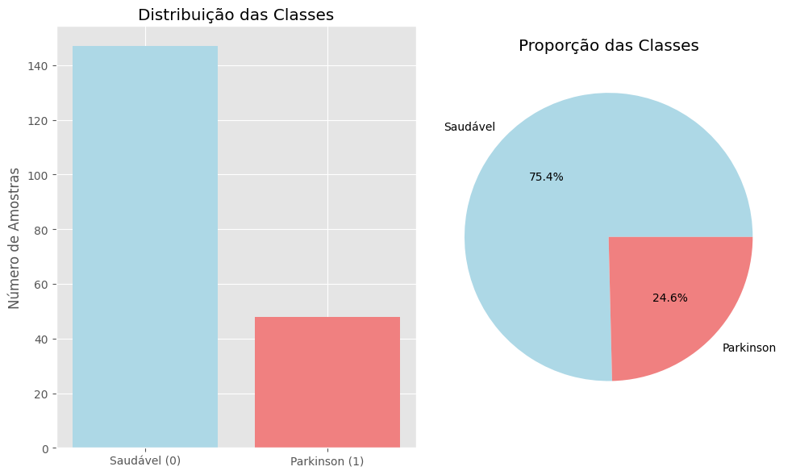
    


    Dataset balanceado: Não
    


```python
# === bases ===
conn = sqlite3.connect('database.db')

df_resultados = pd.read_sql_query('SELECT * FROM pso_resultados', conn)
df_execucao = pd.read_sql_query('SELECT * FROM pso_execucao', conn)

# Verificar quantos experimentos existem
experimentos = sorted(df_resultados['num_experimento'].unique())

```


```python
# Exibir informações básicas para entender a estrutura dos dados
#execucao_info = df_execucao.info()
#resultados_info = df_resultados.info()

# Visualizar as primeiras linhas de cada arquivo para verificar a estrutura dos dados
#execucao_head = df_execucao.head()
#resultados_head = df_resultados.head()

print("-"*80)
print("Execução Info")
print("-"*80)
display(df_execucao.head(32))
display(df_execucao.info())
print("-"*80)
print("Resutaldos Info")
print("-"*80)
display(df_resultados.head())
display(df_resultados.info())

```

    --------------------------------------------------------------------------------
    Execução Info
    --------------------------------------------------------------------------------
    


<div>
<style scoped>
    .dataframe tbody tr th:only-of-type {
        vertical-align: middle;
    }

    .dataframe tbody tr th {
        vertical-align: top;
    }

    .dataframe thead th {
        text-align: right;
    }
</style>
<table border="1" class="dataframe">
  <thead>
    <tr style="text-align: right;">
      <th></th>
      <th>num_experimento</th>
      <th>tempo_total_seg</th>
      <th>tempo_medio_iteracao</th>
      <th>tempo_medio_treino_particula</th>
      <th>uso_medio_cpu</th>
      <th>uso_max_memoria_mb</th>
      <th>uso_disco_mb</th>
      <th>total_iteracoes</th>
    </tr>
  </thead>
  <tbody>
    <tr>
      <th>0</th>
      <td>1</td>
      <td>4948.097461</td>
      <td>247.403929</td>
      <td>12.346696</td>
      <td>35.705</td>
      <td>4914.894531</td>
      <td>14405.937500</td>
      <td>20</td>
    </tr>
    <tr>
      <th>1</th>
      <td>2</td>
      <td>4594.264542</td>
      <td>229.712050</td>
      <td>11.475252</td>
      <td>18.820</td>
      <td>7326.292969</td>
      <td>14406.525000</td>
      <td>20</td>
    </tr>
    <tr>
      <th>2</th>
      <td>3</td>
      <td>1950.898622</td>
      <td>97.544319</td>
      <td>4.870411</td>
      <td>8.350</td>
      <td>7198.152344</td>
      <td>75706.500586</td>
      <td>20</td>
    </tr>
    <tr>
      <th>3</th>
      <td>4</td>
      <td>3137.625629</td>
      <td>156.880671</td>
      <td>7.838411</td>
      <td>5.395</td>
      <td>11937.957031</td>
      <td>75711.219336</td>
      <td>20</td>
    </tr>
    <tr>
      <th>4</th>
      <td>5</td>
      <td>4905.074216</td>
      <td>245.252982</td>
      <td>12.257010</td>
      <td>9.675</td>
      <td>18707.335938</td>
      <td>75693.994336</td>
      <td>20</td>
    </tr>
    <tr>
      <th>5</th>
      <td>6</td>
      <td>6308.600388</td>
      <td>315.429382</td>
      <td>15.765303</td>
      <td>8.130</td>
      <td>24925.613281</td>
      <td>75664.475000</td>
      <td>20</td>
    </tr>
    <tr>
      <th>6</th>
      <td>7</td>
      <td>1220.905657</td>
      <td>61.045231</td>
      <td>3.044485</td>
      <td>2.670</td>
      <td>6481.929688</td>
      <td>14406.750000</td>
      <td>20</td>
    </tr>
    <tr>
      <th>7</th>
      <td>8</td>
      <td>2135.741824</td>
      <td>106.786956</td>
      <td>5.331108</td>
      <td>1.000</td>
      <td>13218.125000</td>
      <td>14406.768750</td>
      <td>20</td>
    </tr>
    <tr>
      <th>8</th>
      <td>9</td>
      <td>2609.186479</td>
      <td>130.459221</td>
      <td>6.514957</td>
      <td>1.220</td>
      <td>17630.972656</td>
      <td>14406.875000</td>
      <td>20</td>
    </tr>
    <tr>
      <th>9</th>
      <td>10</td>
      <td>1490.458176</td>
      <td>74.522831</td>
      <td>3.718303</td>
      <td>1.285</td>
      <td>8436.273438</td>
      <td>14407.000000</td>
      <td>20</td>
    </tr>
    <tr>
      <th>10</th>
      <td>11</td>
      <td>2065.960036</td>
      <td>103.297386</td>
      <td>5.159251</td>
      <td>7.630</td>
      <td>7495.628906</td>
      <td>75526.750781</td>
      <td>20</td>
    </tr>
    <tr>
      <th>11</th>
      <td>12</td>
      <td>3475.198171</td>
      <td>173.759257</td>
      <td>8.682336</td>
      <td>6.820</td>
      <td>13450.382812</td>
      <td>75526.857031</td>
      <td>20</td>
    </tr>
    <tr>
      <th>12</th>
      <td>13</td>
      <td>5105.174047</td>
      <td>255.258135</td>
      <td>12.757283</td>
      <td>8.275</td>
      <td>20144.839844</td>
      <td>75526.991016</td>
      <td>20</td>
    </tr>
    <tr>
      <th>13</th>
      <td>14</td>
      <td>6724.356197</td>
      <td>336.217169</td>
      <td>16.805234</td>
      <td>4.590</td>
      <td>26976.300781</td>
      <td>75527.132812</td>
      <td>20</td>
    </tr>
    <tr>
      <th>14</th>
      <td>15</td>
      <td>1920.338462</td>
      <td>96.016271</td>
      <td>4.795136</td>
      <td>23.810</td>
      <td>6399.457031</td>
      <td>75495.375000</td>
      <td>20</td>
    </tr>
    <tr>
      <th>15</th>
      <td>16</td>
      <td>3814.772471</td>
      <td>190.737975</td>
      <td>9.531231</td>
      <td>20.555</td>
      <td>13341.199219</td>
      <td>75526.238086</td>
      <td>20</td>
    </tr>
    <tr>
      <th>16</th>
      <td>17</td>
      <td>1757.053096</td>
      <td>87.851985</td>
      <td>4.386974</td>
      <td>9.305</td>
      <td>6364.695312</td>
      <td>75557.143555</td>
      <td>20</td>
    </tr>
    <tr>
      <th>17</th>
      <td>18</td>
      <td>2804.607221</td>
      <td>140.229696</td>
      <td>7.005849</td>
      <td>4.570</td>
      <td>10800.890625</td>
      <td>75551.376172</td>
      <td>20</td>
    </tr>
    <tr>
      <th>18</th>
      <td>19</td>
      <td>4008.317052</td>
      <td>200.415209</td>
      <td>10.015141</td>
      <td>5.245</td>
      <td>15786.527344</td>
      <td>75552.859766</td>
      <td>20</td>
    </tr>
    <tr>
      <th>19</th>
      <td>20</td>
      <td>1707.209165</td>
      <td>85.359778</td>
      <td>4.262338</td>
      <td>7.215</td>
      <td>6291.714844</td>
      <td>75557.161133</td>
      <td>20</td>
    </tr>
    <tr>
      <th>20</th>
      <td>21</td>
      <td>2986.855315</td>
      <td>149.342068</td>
      <td>7.461485</td>
      <td>5.090</td>
      <td>11556.148438</td>
      <td>75555.657422</td>
      <td>20</td>
    </tr>
    <tr>
      <th>21</th>
      <td>22</td>
      <td>4566.824404</td>
      <td>228.340546</td>
      <td>11.411404</td>
      <td>8.180</td>
      <td>18067.191406</td>
      <td>75556.466602</td>
      <td>20</td>
    </tr>
    <tr>
      <th>22</th>
      <td>23</td>
      <td>1528.261057</td>
      <td>76.412369</td>
      <td>3.814992</td>
      <td>13.195</td>
      <td>4992.375000</td>
      <td>75594.448047</td>
      <td>20</td>
    </tr>
    <tr>
      <th>23</th>
      <td>24</td>
      <td>3016.637644</td>
      <td>150.831223</td>
      <td>7.535920</td>
      <td>11.540</td>
      <td>11079.875000</td>
      <td>75562.842383</td>
      <td>20</td>
    </tr>
    <tr>
      <th>24</th>
      <td>25</td>
      <td>4757.744907</td>
      <td>237.886593</td>
      <td>11.888680</td>
      <td>7.095</td>
      <td>17952.085938</td>
      <td>75566.356055</td>
      <td>20</td>
    </tr>
    <tr>
      <th>25</th>
      <td>26</td>
      <td>1852.168493</td>
      <td>92.607861</td>
      <td>4.624763</td>
      <td>7.650</td>
      <td>6787.707031</td>
      <td>75586.890234</td>
      <td>20</td>
    </tr>
    <tr>
      <th>26</th>
      <td>27</td>
      <td>3339.066235</td>
      <td>166.952684</td>
      <td>8.341990</td>
      <td>9.955</td>
      <td>12812.281250</td>
      <td>75588.344141</td>
      <td>20</td>
    </tr>
    <tr>
      <th>27</th>
      <td>28</td>
      <td>5171.503472</td>
      <td>258.574539</td>
      <td>12.923109</td>
      <td>7.800</td>
      <td>19471.148438</td>
      <td>75591.541992</td>
      <td>20</td>
    </tr>
    <tr>
      <th>28</th>
      <td>29</td>
      <td>61966.953702</td>
      <td>3098.344111</td>
      <td>154.909117</td>
      <td>44.375</td>
      <td>6092.613281</td>
      <td>216228.479102</td>
      <td>20</td>
    </tr>
    <tr>
      <th>29</th>
      <td>30</td>
      <td>4208.306617</td>
      <td>210.411531</td>
      <td>10.513796</td>
      <td>42.555</td>
      <td>7377.886719</td>
      <td>221547.493555</td>
      <td>20</td>
    </tr>
    <tr>
      <th>30</th>
      <td>31</td>
      <td>2452.268172</td>
      <td>122.611780</td>
      <td>6.124018</td>
      <td>16.250</td>
      <td>7248.109375</td>
      <td>201415.264844</td>
      <td>20</td>
    </tr>
    <tr>
      <th>31</th>
      <td>32</td>
      <td>3297.756357</td>
      <td>164.886804</td>
      <td>8.237562</td>
      <td>35.755</td>
      <td>11378.953125</td>
      <td>201452.963281</td>
      <td>20</td>
    </tr>
  </tbody>
</table>
</div>


    <class 'pandas.core.frame.DataFrame'>
    RangeIndex: 32 entries, 0 to 31
    Data columns (total 8 columns):
     #   Column                        Non-Null Count  Dtype  
    ---  ------                        --------------  -----  
     0   num_experimento               32 non-null     int64  
     1   tempo_total_seg               32 non-null     float64
     2   tempo_medio_iteracao          32 non-null     float64
     3   tempo_medio_treino_particula  32 non-null     float64
     4   uso_medio_cpu                 32 non-null     float64
     5   uso_max_memoria_mb            32 non-null     float64
     6   uso_disco_mb                  32 non-null     float64
     7   total_iteracoes               32 non-null     int64  
    dtypes: float64(6), int64(2)
    memory usage: 2.1 KB
    


    None


    --------------------------------------------------------------------------------
    Resutaldos Info
    --------------------------------------------------------------------------------
    


<div>
<style scoped>
    .dataframe tbody tr th:only-of-type {
        vertical-align: middle;
    }

    .dataframe tbody tr th {
        vertical-align: top;
    }

    .dataframe thead th {
        text-align: right;
    }
</style>
<table border="1" class="dataframe">
  <thead>
    <tr style="text-align: right;">
      <th></th>
      <th>num_experimento</th>
      <th>num_iteracao</th>
      <th>num_particula</th>
      <th>pos_camada</th>
      <th>pos_n1</th>
      <th>pos_n2</th>
      <th>pos_n3</th>
      <th>pos_lr</th>
      <th>vel_camada</th>
      <th>vel_n1</th>
      <th>...</th>
      <th>vel_lr</th>
      <th>pbest_camada</th>
      <th>pbest_n1</th>
      <th>pbest_n2</th>
      <th>pbest_n3</th>
      <th>pbest_lr</th>
      <th>num_camadas</th>
      <th>f1_score</th>
      <th>peso</th>
      <th>int_best</th>
    </tr>
  </thead>
  <tbody>
    <tr>
      <th>0</th>
      <td>1</td>
      <td>0</td>
      <td>0</td>
      <td>1.3</td>
      <td>20.000000</td>
      <td>20.0</td>
      <td>20.000000</td>
      <td>0.000010</td>
      <td>0.3</td>
      <td>12.000000</td>
      <td>...</td>
      <td>-0.009999</td>
      <td>1.0</td>
      <td>8.0</td>
      <td>8.0</td>
      <td>8.0</td>
      <td>0.00001</td>
      <td>1</td>
      <td>0.111111</td>
      <td>0.888889</td>
      <td>0</td>
    </tr>
    <tr>
      <th>1</th>
      <td>1</td>
      <td>0</td>
      <td>1</td>
      <td>1.3</td>
      <td>60.000000</td>
      <td>60.0</td>
      <td>60.000000</td>
      <td>0.043299</td>
      <td>0.3</td>
      <td>12.000000</td>
      <td>...</td>
      <td>0.009999</td>
      <td>1.0</td>
      <td>48.0</td>
      <td>48.0</td>
      <td>48.0</td>
      <td>0.03330</td>
      <td>1</td>
      <td>0.852941</td>
      <td>0.147059</td>
      <td>0</td>
    </tr>
    <tr>
      <th>2</th>
      <td>1</td>
      <td>0</td>
      <td>2</td>
      <td>1.3</td>
      <td>100.000000</td>
      <td>100.0</td>
      <td>88.014403</td>
      <td>0.056701</td>
      <td>0.3</td>
      <td>12.000000</td>
      <td>...</td>
      <td>-0.009999</td>
      <td>1.0</td>
      <td>88.0</td>
      <td>88.0</td>
      <td>88.0</td>
      <td>0.06670</td>
      <td>1</td>
      <td>0.852941</td>
      <td>0.147059</td>
      <td>0</td>
    </tr>
    <tr>
      <th>3</th>
      <td>1</td>
      <td>0</td>
      <td>3</td>
      <td>1.3</td>
      <td>127.725939</td>
      <td>128.0</td>
      <td>127.904723</td>
      <td>0.090001</td>
      <td>0.3</td>
      <td>-0.274061</td>
      <td>...</td>
      <td>-0.009999</td>
      <td>1.0</td>
      <td>128.0</td>
      <td>128.0</td>
      <td>128.0</td>
      <td>0.10000</td>
      <td>1</td>
      <td>0.920635</td>
      <td>0.079365</td>
      <td>0</td>
    </tr>
    <tr>
      <th>4</th>
      <td>1</td>
      <td>0</td>
      <td>4</td>
      <td>1.3</td>
      <td>20.000000</td>
      <td>20.0</td>
      <td>17.079082</td>
      <td>0.000010</td>
      <td>0.3</td>
      <td>12.000000</td>
      <td>...</td>
      <td>-0.009999</td>
      <td>1.0</td>
      <td>8.0</td>
      <td>8.0</td>
      <td>8.0</td>
      <td>0.00001</td>
      <td>1</td>
      <td>0.693878</td>
      <td>0.306122</td>
      <td>0</td>
    </tr>
  </tbody>
</table>
<p>5 rows × 22 columns</p>
</div>


    <class 'pandas.core.frame.DataFrame'>
    RangeIndex: 12800 entries, 0 to 12799
    Data columns (total 22 columns):
     #   Column           Non-Null Count  Dtype  
    ---  ------           --------------  -----  
     0   num_experimento  12800 non-null  int64  
     1   num_iteracao     12800 non-null  int64  
     2   num_particula    12800 non-null  int64  
     3   pos_camada       12800 non-null  float64
     4   pos_n1           12800 non-null  float64
     5   pos_n2           12800 non-null  float64
     6   pos_n3           12800 non-null  float64
     7   pos_lr           12800 non-null  float64
     8   vel_camada       12800 non-null  float64
     9   vel_n1           12800 non-null  float64
     10  vel_n2           12800 non-null  float64
     11  vel_n3           12800 non-null  float64
     12  vel_lr           12800 non-null  float64
     13  pbest_camada     12800 non-null  float64
     14  pbest_n1         12800 non-null  float64
     15  pbest_n2         12800 non-null  float64
     16  pbest_n3         12800 non-null  float64
     17  pbest_lr         12800 non-null  float64
     18  num_camadas      12800 non-null  int64  
     19  f1_score         12800 non-null  float64
     20  peso             12800 non-null  float64
     21  int_best         12800 non-null  int64  
    dtypes: float64(17), int64(5)
    memory usage: 2.1 MB
    


    None


## Análise Estatística e Avaliação de Desempenho do PSO
Abaixo apresentaremos a análise estatística aprofundada para avaliar o desempenho do algoritmo de Otimização por Enxame de Partículas (PSO). Esta etapa inicial foca na:
- Identificação da melhor e pior partícula em termos de desempenho geral
- Determinação dos valores médios e desvios padrão de por experimento
- Avaliação da convergência dos experimentos, verificando o comportamento médio do desempenho ao longo das iterações. 


```python
# Melhor partícula geral (maior f1-score)
melhor_particula_geral = df_resultados.loc[df_resultados['f1_score'].idxmax()]

# Pior partícula geral (menor f1-score)
pior_particula_geral = df_resultados.loc[df_resultados['f1_score'].idxmin()]

# Estatísticas por experimento (média, desvio padrão e melhor partícula)
estatisticas_experimento = df_resultados.groupby('num_experimento')['f1_score'].agg(['mean', 'std', 'max', 'min'])

# Encontrar o experimento com a melhor média de f1-score
melhor_media_experimento = estatisticas_experimento['mean'].idxmax()
melhor_media_valor = estatisticas_experimento.loc[melhor_media_experimento]

# Calcular a melhoria percentual e absoluta entre o pior e o melhor valor médio dos experimentos
pior_media_valor = estatisticas_experimento['mean'].min()
melhoria_absoluta = melhor_media_valor['mean'] - pior_media_valor
melhoria_percentual = (melhoria_absoluta / pior_media_valor) * 100

# Exibir resultados iniciais da análise estatística
print("-"*80)
print("Melhor Particula Geral: ")
print("-"*80)
display(melhor_particula_geral)
print("-"*80)
print("Pior Particula Geral: ")
print("-"*80)
display(pior_particula_geral)
print("-"*80)
print("Estatísticas dos Experimentos: ")
print("-"*80)
display(estatisticas_experimento)
print("-"*80)
print("Experimento com melhor Média: ", melhor_media_experimento)
print("-"*80)
display(melhor_media_valor)
print("-"*80)
print("melhoria absoluta: ", melhoria_absoluta)
print("-"*80)
print("melhoria percentual: ", melhoria_percentual)
print("-"*80)
```

    --------------------------------------------------------------------------------
    Melhor Particula Geral: 
    --------------------------------------------------------------------------------
    


    num_experimento      5.000000
    num_iteracao        12.000000
    num_particula       17.000000
    pos_camada           3.609194
    pos_n1             128.000000
    pos_n2              97.768256
    pos_n3             128.000000
    pos_lr               0.100000
    vel_camada          -0.067591
    vel_n1               8.400000
    vel_n2              -8.400000
    vel_n3               8.400000
    vel_lr               0.006999
    pbest_camada         3.676786
    pbest_n1           128.000000
    pbest_n2           106.168256
    pbest_n3           128.000000
    pbest_lr             0.100000
    num_camadas          4.000000
    f1_score             1.000000
    peso                 0.000000
    int_best             1.000000
    Name: 1857, dtype: float64


    --------------------------------------------------------------------------------
    Pior Particula Geral: 
    --------------------------------------------------------------------------------
    


    num_experimento     1.000000
    num_iteracao        0.000000
    num_particula      16.000000
    pos_camada          4.000000
    pos_n1             20.000000
    pos_n2             20.000000
    pos_n3             20.000000
    pos_lr              0.000010
    vel_camada          0.300000
    vel_n1             12.000000
    vel_n2             12.000000
    vel_n3             12.000000
    vel_lr             -0.009999
    pbest_camada        4.000000
    pbest_n1            8.000000
    pbest_n2            8.000000
    pbest_n3            8.000000
    pbest_lr            0.000010
    num_camadas         4.000000
    f1_score            0.000000
    peso                1.000000
    int_best            0.000000
    Name: 16, dtype: float64


    --------------------------------------------------------------------------------
    Estatísticas dos Experimentos: 
    --------------------------------------------------------------------------------
    


<div>
<style scoped>
    .dataframe tbody tr th:only-of-type {
        vertical-align: middle;
    }

    .dataframe tbody tr th {
        vertical-align: top;
    }

    .dataframe thead th {
        text-align: right;
    }
</style>
<table border="1" class="dataframe">
  <thead>
    <tr style="text-align: right;">
      <th></th>
      <th>mean</th>
      <th>std</th>
      <th>max</th>
      <th>min</th>
    </tr>
    <tr>
      <th>num_experimento</th>
      <th></th>
      <th></th>
      <th></th>
      <th></th>
    </tr>
  </thead>
  <tbody>
    <tr>
      <th>1</th>
      <td>0.823660</td>
      <td>0.201096</td>
      <td>0.983051</td>
      <td>0.0</td>
    </tr>
    <tr>
      <th>2</th>
      <td>0.850776</td>
      <td>0.117696</td>
      <td>0.983051</td>
      <td>0.0</td>
    </tr>
    <tr>
      <th>3</th>
      <td>0.849325</td>
      <td>0.128835</td>
      <td>0.983051</td>
      <td>0.0</td>
    </tr>
    <tr>
      <th>4</th>
      <td>0.854397</td>
      <td>0.099408</td>
      <td>0.983051</td>
      <td>0.0</td>
    </tr>
    <tr>
      <th>5</th>
      <td>0.849642</td>
      <td>0.158338</td>
      <td>1.000000</td>
      <td>0.0</td>
    </tr>
    <tr>
      <th>6</th>
      <td>0.847258</td>
      <td>0.131136</td>
      <td>0.983051</td>
      <td>0.0</td>
    </tr>
    <tr>
      <th>7</th>
      <td>0.852164</td>
      <td>0.111108</td>
      <td>0.983051</td>
      <td>0.0</td>
    </tr>
    <tr>
      <th>8</th>
      <td>0.857291</td>
      <td>0.136833</td>
      <td>1.000000</td>
      <td>0.0</td>
    </tr>
    <tr>
      <th>9</th>
      <td>0.844743</td>
      <td>0.096171</td>
      <td>0.966667</td>
      <td>0.0</td>
    </tr>
    <tr>
      <th>10</th>
      <td>0.836826</td>
      <td>0.189696</td>
      <td>1.000000</td>
      <td>0.0</td>
    </tr>
    <tr>
      <th>11</th>
      <td>0.833876</td>
      <td>0.175032</td>
      <td>1.000000</td>
      <td>0.0</td>
    </tr>
    <tr>
      <th>12</th>
      <td>0.841138</td>
      <td>0.149564</td>
      <td>0.983051</td>
      <td>0.0</td>
    </tr>
    <tr>
      <th>13</th>
      <td>0.839185</td>
      <td>0.162230</td>
      <td>0.983051</td>
      <td>0.0</td>
    </tr>
    <tr>
      <th>14</th>
      <td>0.822814</td>
      <td>0.180732</td>
      <td>0.983051</td>
      <td>0.0</td>
    </tr>
    <tr>
      <th>15</th>
      <td>0.829737</td>
      <td>0.149037</td>
      <td>0.983051</td>
      <td>0.0</td>
    </tr>
    <tr>
      <th>16</th>
      <td>0.842615</td>
      <td>0.150930</td>
      <td>1.000000</td>
      <td>0.0</td>
    </tr>
    <tr>
      <th>17</th>
      <td>0.846698</td>
      <td>0.120435</td>
      <td>0.983051</td>
      <td>0.0</td>
    </tr>
    <tr>
      <th>18</th>
      <td>0.847210</td>
      <td>0.102297</td>
      <td>1.000000</td>
      <td>0.0</td>
    </tr>
    <tr>
      <th>19</th>
      <td>0.844073</td>
      <td>0.136218</td>
      <td>1.000000</td>
      <td>0.0</td>
    </tr>
    <tr>
      <th>20</th>
      <td>0.841778</td>
      <td>0.115364</td>
      <td>0.966667</td>
      <td>0.0</td>
    </tr>
    <tr>
      <th>21</th>
      <td>0.842617</td>
      <td>0.121691</td>
      <td>0.983051</td>
      <td>0.0</td>
    </tr>
    <tr>
      <th>22</th>
      <td>0.847996</td>
      <td>0.121324</td>
      <td>0.983051</td>
      <td>0.0</td>
    </tr>
    <tr>
      <th>23</th>
      <td>0.850298</td>
      <td>0.114489</td>
      <td>0.983051</td>
      <td>0.0</td>
    </tr>
    <tr>
      <th>24</th>
      <td>0.849878</td>
      <td>0.125156</td>
      <td>0.983051</td>
      <td>0.0</td>
    </tr>
    <tr>
      <th>25</th>
      <td>0.840011</td>
      <td>0.175055</td>
      <td>1.000000</td>
      <td>0.0</td>
    </tr>
    <tr>
      <th>26</th>
      <td>0.836783</td>
      <td>0.141977</td>
      <td>1.000000</td>
      <td>0.0</td>
    </tr>
    <tr>
      <th>27</th>
      <td>0.833710</td>
      <td>0.142753</td>
      <td>0.983051</td>
      <td>0.0</td>
    </tr>
    <tr>
      <th>28</th>
      <td>0.856042</td>
      <td>0.123997</td>
      <td>1.000000</td>
      <td>0.0</td>
    </tr>
    <tr>
      <th>29</th>
      <td>0.849447</td>
      <td>0.161109</td>
      <td>1.000000</td>
      <td>0.0</td>
    </tr>
    <tr>
      <th>30</th>
      <td>0.853451</td>
      <td>0.128909</td>
      <td>0.983051</td>
      <td>0.0</td>
    </tr>
    <tr>
      <th>31</th>
      <td>0.851511</td>
      <td>0.144551</td>
      <td>0.983051</td>
      <td>0.0</td>
    </tr>
    <tr>
      <th>32</th>
      <td>0.847442</td>
      <td>0.113350</td>
      <td>0.983051</td>
      <td>0.0</td>
    </tr>
  </tbody>
</table>
</div>


    --------------------------------------------------------------------------------
    Experimento com melhor Média:  8
    --------------------------------------------------------------------------------
    


    mean    0.857291
    std     0.136833
    max     1.000000
    min     0.000000
    Name: 8, dtype: float64


    --------------------------------------------------------------------------------
    melhoria absoluta:  0.03447676142488232
    --------------------------------------------------------------------------------
    melhoria percentual:  4.190103687419031
    --------------------------------------------------------------------------------
    

## Resultados

### Análise da Evolução da Aptidão (F1-score) nos Experimentos com Otimização por PSO

A figura apresenta a evolução dos valores de aptidão, medidos pelo F1-score, ao longo das iterações em cada um dos experimentos independentes realizados utilizando o algoritmo Particle Swarm Optimization (PSO). Cada gráfico ilustra o comportamento do melhor indivíduo, da média da população e do pior indivíduo por iteração, permitindo observar claramente a dinâmica de convergência e a dispersão dos resultados ao longo do processo de otimização. Em geral, é possível notar a rápida melhoria inicial na aptidão, seguida por estabilização, indicando convergência dos parâmetros otimizados pelo PSO.


```python
#-------------------------------------------------------------------------------------------------------------#
# Função para plotar os gráficos da aptidão de todos os experimentos
#-------------------------------------------------------------------------------------------------------------#
def plotar_evolucao_experimentos(df_method):
    # Definir número de gráficos por linha
    num_cols = 4
    num_rows = (len(experimentos) + num_cols - 1) // num_cols  # Calcular número de linhas
    # Criar figura e eixosimport matplotlib.pyplot as plt

    fig, axes = plt.subplots(num_rows, num_cols, figsize=(15, 5 * num_rows))
    axes = axes.flatten()  # Transformar em array 1D para facilitar o acesso
    # Criar gráficos individuais
    for idx, exp in enumerate(experimentos):
        df_exp = df_method[df_method['num_experimento'] == exp]        
        # Agrupar por geração
        stats = df_exp.groupby('num_iteracao').agg(
            media_aptidao=('f1_score', 'mean'),
            melhor_aptidao=('f1_score', 'max'),
            pior_aptidao=('f1_score', 'min')
        ).reset_index()        
        # Plot
        ax = axes[idx]
        ax.plot(stats['num_iteracao'], stats['media_aptidao'], label='Média da População', linewidth=2)
        ax.plot(stats['num_iteracao'], stats['melhor_aptidao'], label='Melhor Indivíduo', linewidth=2)
        ax.plot(stats['num_iteracao'], stats['pior_aptidao'], label='Pior Indivíduo', linewidth=2)
        ax.set_title(f"Experimento {exp}", fontsize=12)
        ax.set_xlabel("Iteração")
        ax.set_ylabel("Aptidão")
        ax.legend()
        ax.grid(True)

    # Remover eixos extras (caso haja espaços vazios)
    for i in range(len(experimentos), len(axes)):
        fig.delaxes(axes[i])

    plt.tight_layout()
    plt.show()

plotar_evolucao_experimentos(df_resultados)
```


    
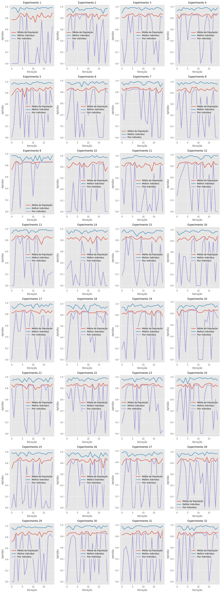
    


### Evolução Média da Aptidão entre os Experimentos:
O gráfico abaixo ilustra a evolução média da aptidão, medida por F1-score ao longo de 20 iterações do Particle Swarm Optimization (PSO). Observa-se uma tendência crescente e estabilizada da aptidão média da população, bem como do melhor indivíduo, indicando uma convergência do algoritmo.

- A curva azul mostra a média da população, que sobe rapidamente de 0.80 para cerca de 0.86 nas primeiras cinco iterações e, a partir daí, estabiliza-se com variações muito pequenas, sugerindo convergência global. 
- A linha laranja, correspondente à média dos melhores indivíduos, permanece constantemente acima de 0.94 e apresenta leve inclinação ascendente, indicando que o topo da população continua aperfeiçoando-se mesmo após a estabilização geral.
- A curva verde mostra a média dos piores indivíduos, a qual parte de 0.25 e alcança um pico próximo de 0.65 na quarta iteração e depois oscila entre 0.35 e 0.55; esse comportamento revela ganhos iniciais rápidos seguidos de flutuações típicas da exploração residual do algoritmo. 
- A linha vermelha tracejada representa o desvio-padrão médio da população: ela decresce acentuadamente nas primeiras iterações e mantém-se baixa, com pequenas oscilações, o que confirma a redução da variabilidade interna e reforça o indício de convergência já observado nas curvas de média.


```python
#-------------------------------------------------------------------------------------------------------------#
# Função para plotar a aptidão média de todos os experimentos (média melhores, média piores e média população)
#-------------------------------------------------------------------------------------------------------------#
def plotar_evolucao_media(df_method):
    # Agrupar por experimento e geração
    agrupado = df_method.groupby(['num_experimento', 'num_iteracao'])

    # Calcular estatísticas por geração em cada experimento
    estatisticas = []
    for (exp, iter), grupo in agrupado:
        media_aptidao = grupo['f1_score'].mean()
        melhor = grupo['f1_score'].max()
        pior = grupo['f1_score'].min()
        desvio_padrao_aptidao = grupo['f1_score'].std()
        estatisticas.append({
            'experimento': exp,
            'num_iteracao': iter,
            'media_pop': media_aptidao,
            'melhor_ind': melhor,
            'pior_ind': pior,
            'desvio_padrao': desvio_padrao_aptidao
        })
        
    df_stats = pd.DataFrame(estatisticas)

    # Calcular médias por geração entre os 32 experimentos
    evolucao = df_stats.groupby('num_iteracao').agg({
        'media_pop': 'mean',
        'melhor_ind': 'mean',
        'pior_ind': 'mean',
        'desvio_padrao': 'mean'
    }).reset_index()

    # Plot
    plt.figure(figsize=(12, 6))
    plt.plot(evolucao['num_iteracao'], evolucao['media_pop'], label='Média da População', linewidth=2)
    plt.plot(evolucao['num_iteracao'], evolucao['melhor_ind'], label='Média dos Melhores Indivíduos', linewidth=2)
    plt.plot(evolucao['num_iteracao'], evolucao['pior_ind'], label='Média dos Piores Indivíduos', linewidth=2)
    plt.plot(evolucao['num_iteracao'], evolucao['desvio_padrao'], label='Média do Desvio Padrão', linewidth=2, linestyle='--')
    plt.title(f'Evolução Média da Aptidão por Iteração', fontsize=14)
    plt.xlabel('Iteração')
    plt.ylabel('Aptidão')
    plt.legend()
    plt.grid(True)
    plt.tight_layout()
    plt.show()

plotar_evolucao_media(df_resultados)
```


    
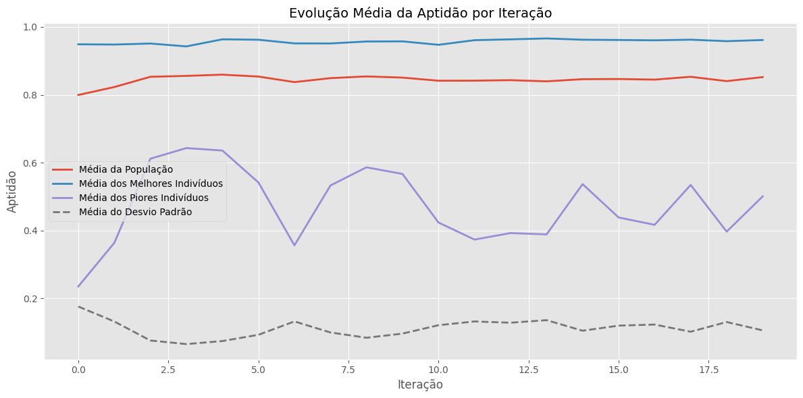
    


O gráfico abaixo destaca, separadamente, a evolução do F1-score médio da população (linha tracejada vermelha) e o F1-score médio dos melhores indivíduos de cada execução (linha contínua azul, acompanhada pela faixa de desvio-padrão).
Nota-se que a maior parte das partículas eleva rapidamente sua aptidão nas primeiras iterações, e depois se estabiliza, mantendo uma distância praticamente constante em relação ao desempenho da elite. Esse padrão é característico do PSO, onde a elite converge velozmente para regiões de alta qualidade, enquanto o restante da população prossegue em exploração moderada, sem evidenciar queda de desempenho nas iterações subsequentes.


```python
convergence_data = database_utils.get_convergence_data()

if len(convergence_data) > 0:

    best_scores = convergence_data.groupby('num_experimento')['best_f1_score'].max()
    
    # Plot 1: Média de convergência
    plt.figure(figsize=(10, 6)) # Nova figura para o segundo gráfico
    avg_convergence = convergence_data.groupby('num_iteracao').agg({
        'best_f1_score': ['mean', 'std'],
        'avg_f1_score': 'mean'
    }).reset_index()
    
    iterations = avg_convergence['num_iteracao']
    best_mean = avg_convergence[('best_f1_score', 'mean')]
    best_std = avg_convergence[('best_f1_score', 'std')]
    avg_mean = avg_convergence[('avg_f1_score', 'mean')]
    
    plt.plot(iterations, best_mean, 'b-', label='Melhor F1 (média)', linewidth=2)
    plt.fill_between(iterations, best_mean - best_std, best_mean + best_std, alpha=0.3, color='blue')
    plt.plot(iterations, avg_mean, 'r--', label='F1 médio', linewidth=2)
    plt.xlabel('Iteração')
    plt.ylabel('F1-Score')
    plt.title('Convergência Média (todos os experimentos)')
    plt.legend()
    plt.grid(True)
    plt.tight_layout() 
    plt.show() 
        
else:
    print("❌ Nenhum dado de convergência encontrado.")
```


    
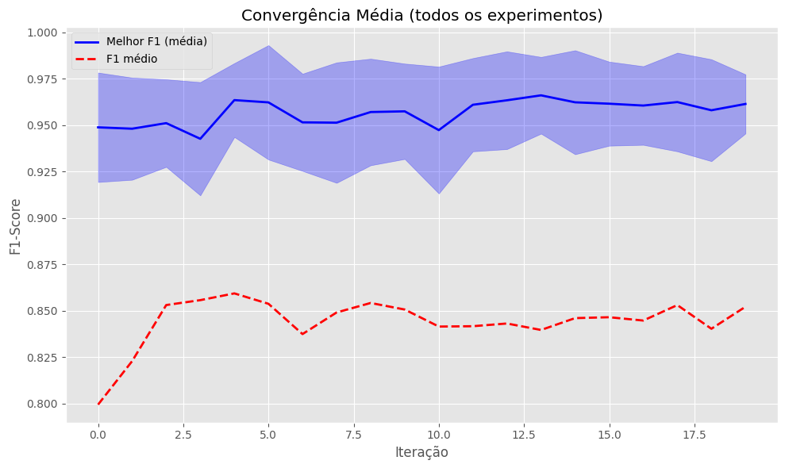
    


### Distribuição da Aptidão Média dos Melhores entre os Experimentos
O boxplot da abaixo ilustra a variação do F1-score obtido pelos melhores indivíduos em quatro pontos do processo evolutivo (iterações 0, 5, 10 e 15) ao longo dos 32 experimentos. 
- Observa-se que já na iteração 0 a mediana situa-se próxima de 0,96, indicando uma população inicial de alta qualidade; no entanto, a presença de caudas inferiores (outliers entre 0,85 e 0,90) revela certa heterogeneidade entre execuções. 
- À iteração 5, a mediana se desloca ligeiramente para cima ( 0,97–0,98) e o intervalo interquartil se estreita, sugerindo ganhos rápidos acompanhados de maior consistência. 
- Na iteração 10 há uma leve redução da mediana para cerca de 0,95, mas sem aumento expressivo da dispersão, o que indica um breve ajuste fino das
soluções. 
- Por fim, na iteração 15 a mediana retorna ao patamar.


```python
if len(convergence_data) > 0:

    best_scores = convergence_data.groupby('num_experimento')['best_f1_score'].max()    
       
    # Plot 2: Boxplot dos F1-scores por iteração
    plt.figure(figsize=(10, 6)) # Nova figura para o quarto gráfico
    iterations_sample = [0, 5, 10, 15, 20, 25, 29]  # Amostra de iterações
    data_for_box = []
    labels_for_box = []
    
    for it in iterations_sample:
        iter_data = convergence_data[convergence_data['num_iteracao'] == it]['best_f1_score']
        if len(iter_data) > 0:
            data_for_box.append(iter_data)
            labels_for_box.append(f'It {it}')
    
    if data_for_box:
        plt.boxplot(data_for_box, labels=labels_for_box)
        plt.ylabel('F1-Score')
        plt.title('Distribuição F1-Score por Iteração')
        plt.xticks(rotation=45)
        plt.grid(True)
    
    plt.tight_layout() # Ajusta o layout
    plt.show() # Mostra o quarto gráfico
    
    # Seções de impressão de texto permanecem inalteradas
    print(f"📈 Análise de convergência:")
    print(f"  • Melhor F1-Score final: {best_scores.max():.4f}")
    print(f"  • F1-Score médio final: {best_scores.mean():.4f}")
    print(f"  • Desvio padrão: {best_scores.std():.4f}")
    # Calcula a melhoria média usando o F1-score médio da iteração 0 (inicial)
    initial_avg_f1_score = avg_convergence[('avg_f1_score', 'mean')].iloc[0]
    print(f"  • Melhoria média: {(best_scores.mean() - initial_avg_f1_score):.4f}")
else:
    print("❌ Nenhum dado de convergência encontrado.")
```


    
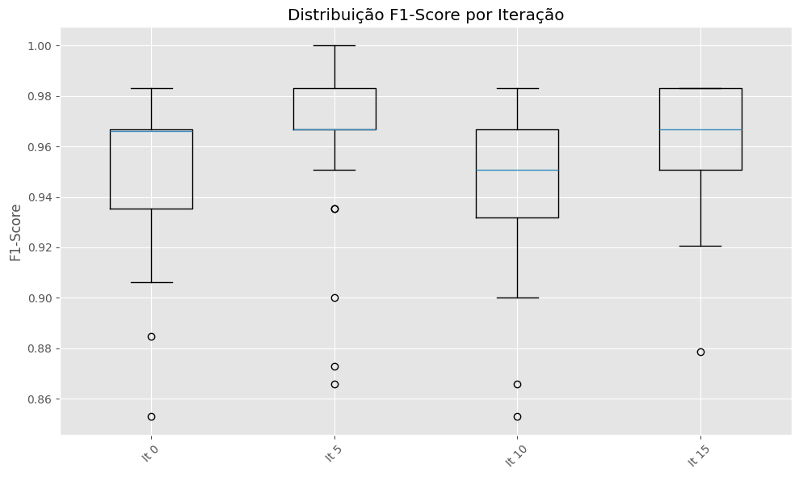
    


    📈 Análise de convergência:
      • Melhor F1-Score final: 1.0000
      • F1-Score médio final: 0.9879
      • Desvio padrão: 0.0098
      • Melhoria média: 0.1884
    

### Análise da Convergência do F1-score Médio nas Iterações do PSO:
A curva do gráfico abaixo representa a média do F1-score por iteração para todos os 32 experimentos realizados.

O gráfico representa a curva média de convergência do F1-score ao longo das iterações em todos os experimentos realizados com Particle Swarm Optimization (PSO). Observa-se uma rápida evolução inicial até aproximadamente a quinta iteração, quando a média do F1-score atinge um valor próximo a 0,86, seguida por oscilações menores que sugerem a estabilização da solução encontrada. Essa estabilização indica uma convergência efetiva do algoritmo, refletindo a capacidade do PSO em alcançar resultados consistentes após poucas iterações.

Observações sobre a Convergência:
- O algoritmo apresentou rápida evolução inicial, alcançando melhorias significativas até a iteração 10.
- A partir da iteração 11, as melhorias médias no desempenho (f1-score) tornaram-se mínimas (abaixo de 0.1% de variação entre iterações consecutivas).

Portanto, consideramos  que o algoritmo convergiu aproximadamente na iteração 11.


```python
import matplotlib.pyplot as plt
import seaborn as sns

# Análise de convergência: evolução média do F1-score por iteração para todos os experimentos
convergencia_df = df_resultados.groupby(['num_iteracao'])['f1_score'].mean().reset_index()

# Plot da curva de convergência
plt.figure(figsize=(12, 6))
sns.lineplot(data=convergencia_df, x='num_iteracao', y='f1_score', marker='o')
plt.title('Curva de Convergência Média do F1-score por Iteração')
plt.xlabel('Iteração')
plt.ylabel('F1-score Médio')
plt.grid(True)
plt.tight_layout()
plt.show()

# Identificar a iteração de convergência
convergencia_df['diff'] = convergencia_df['f1_score'].diff().abs()
iteracao_convergencia = convergencia_df.loc[convergencia_df['diff'] < 0.001, 'num_iteracao'].min()

iteracao_convergencia

```


    
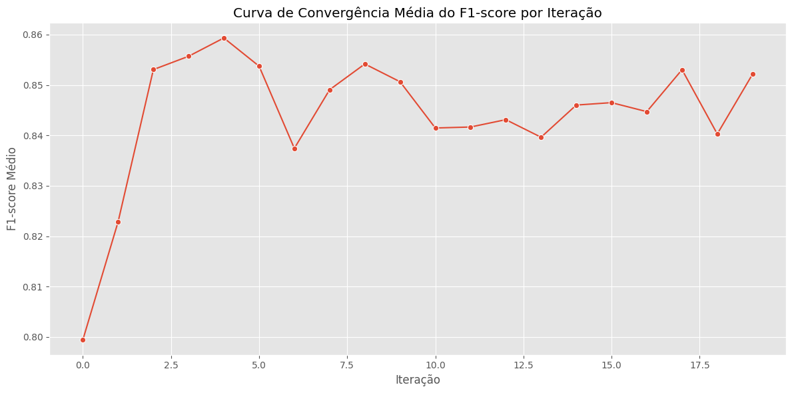
    


    11


## Análise PCA do Espaço de Busca e Distribuição de Desempenho no PSO
O gráfico apresenta a projeção bidimensional do espaço de busca explorado pelo algoritmo Particle Swarm Optimization (PSO), obtida através da Análise de Componentes Principais (PCA). Cada ponto representa uma partícula avaliada durante os experimentos, posicionada segundo suas duas primeiras componentes principais, enquanto as cores indicam o valor do F1-score alcançado. Observa-se uma ampla dispersão das partículas, sugerindo uma boa cobertura do espaço de busca, com regiões concentradas em tons mais claros, indicando áreas associadas a desempenhos elevados. Essa visualização facilita a identificação de regiões promissoras no espaço de soluções e fornece evidências sobre o comportamento exploratório e a capacidade do PSO de convergir para zonas de maior desempenho.


```python
from sklearn.decomposition import PCA
from sklearn.preprocessing import StandardScaler

# Selecionar as variáveis relevantes para PCA (posições dos hiperparâmetros das partículas)
features_pca = ['pos_camada', 'pos_n1', 'pos_n2', 'pos_n3', 'pos_lr']

# Padronizar os dados antes da PCA
scaler = StandardScaler()

posicoes_padronizadas = scaler.fit_transform(df_resultados[features_pca])
# Executar PCA para redução a 2 componentes principais
pca = PCA(n_components=2)
pca_result = pca.fit_transform(posicoes_padronizadas)


# Adicionar resultados da PCA ao dataframe original para visualização
df_resultados['PCA1'] = pca_result[:, 0]
df_resultados['PCA2'] = pca_result[:, 1]

# Plot PCA
plt.figure(figsize=(12, 8))

# sns.scatterplot(
    # data=df_resultados, x='PCA1', y='PCA2', 
    # hue='f1_score', palette='viridis', alpha=0.7
# )

scatter = plt.scatter(
    df_resultados['PCA1'],
    df_resultados['PCA2'],
    c=df_resultados['f1_score'],
    cmap='viridis',
    alpha=0.7
)

plt.title('Análise PCA do Espaço de Busca do PSO')
plt.xlabel('Componente Principal 1')
plt.ylabel('Componente Principal 2')
# plt.colorbar(label='F1-score')
plt.colorbar(scatter, label='F1-score')
plt.grid(True)
plt.tight_layout()
plt.show()

```


    
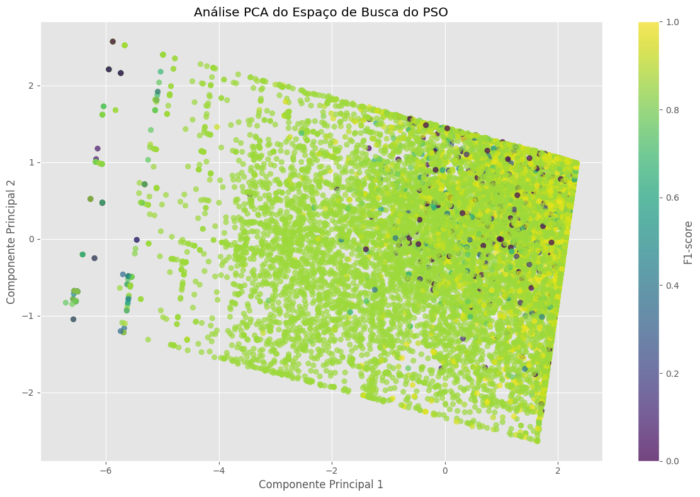
    


### Análise PCA - Exploração do Espaço de Busca:
O gráfico acima mostra o resultado da análise PCA (Componentes Principais) das partículas, permitindo uma visão geral de como o algoritmo PSO explorou o espaço de hiperparâmetros:
- Cada ponto representa uma partícula específica em uma determinada iteração.
- A cor do ponto indica o valor de F1-score, com cores mais claras indicando valores mais altos e cores mais escuras indicando valores mais baixos.

Nota-se que partículas com alto desempenho tendem a agrupar-se em regiões específicas, indicando que o algoritmo identificou zonas promissoras do espaço de busca.
Ao mesmo tempo, a ampla dispersão inicial (partículas de diferentes cores ao longo do gráfico) mostra uma boa exploração inicial antes de convergir para soluções otimizadas.


```python
# Visualização adicional: Evolução das partículas no espaço PCA ao longo das iterações

# Selecionar apenas algumas iterações chave para visualização
iteracoes_chave = [0, 5, 10, 15, 19]

fig, axes = plt.subplots(1, len(iteracoes_chave), figsize=(20, 5), sharex=True, sharey=True)

for ax, iteracao in zip(axes, iteracoes_chave):
    iter_df = df_resultados[df_resultados['num_iteracao'] == iteracao]
    scatter = ax.scatter(iter_df['PCA1'], iter_df['PCA2'], c=iter_df['f1_score'], cmap='viridis', alpha=0.7)
    ax.set_title(f'Iteração {iteracao}')
    ax.grid(True)

fig.suptitle('Evolução das Partículas no Espaço PCA ao Longo das Iterações', fontsize=16)
fig.text(0.5, 0.04, 'Componente Principal 1', ha='center', fontsize=12)
fig.text(0.09, 0.5, 'Componente Principal 2', va='center', rotation='vertical', fontsize=12)
cbar = fig.colorbar(scatter, ax=axes.ravel().tolist(), shrink=0.6, orientation='vertical')
cbar.set_label('F1-score')
plt.tight_layout(rect=[0.03, 0.03, 1, 0.95])
plt.show()

```


    
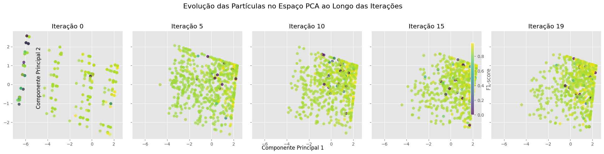
    


### Evolução das Partículas no Espaço PCA ao Longo das Iterações:
O conjunto de gráficos abaixo exibe a trajetória das partículas no espaço reduzido (PCA) em diferentes iterações selecionadas:

- Iteração 0: As partículas estão amplamente dispersas no espaço, indicando forte exploração inicial.
- Iteração 5: Começa a formação de agrupamentos mais densos em regiões específicas, mostrando que o algoritmo começa a identificar regiões promissoras.
- Iteração 10: Grupos distintos se formam claramente, indicando a convergência das partículas para regiões com bom desempenho.
- Iteração 15 e 19: As partículas se concentram significativamente em uma região específica, indicando forte convergência e explotação do espaço de soluções.

Esses gráficos reforçam visualmente a identificação da iteração 11 como ponto aproximado de convergência, já apontado anteriormente.


```python
iteracoes_chave = [0, 5, 10, 15, 19] # Exemplo de iterações, ajuste conforme necessário

for iteracao in iteracoes_chave:
    # Criar uma nova figura para cada gráfico
    plt.figure(figsize=(8, 7)) 
    
    # Filtrar os dados para a iteração atual
    iter_df = df_resultados[df_resultados['num_iteracao'] == iteracao]
    
    # Verificar se há dados para a iteração antes de tentar plotar
    if not iter_df.empty:
        # Criar o gráfico de dispersão (scatter plot)
        scatter = plt.scatter(iter_df['PCA1'], iter_df['PCA2'], 
                              c=iter_df['f1_score'], # Cor dos pontos baseada no f1_score
                              cmap='viridis', # Mapa de cores
                              alpha=0.7) # Transparência dos pontos
        
        # Configurações do gráfico
        plt.title(f'Evolução das Partículas: Iteração {iteracao}', fontsize=14)
        plt.xlabel('Componente Principal 1', fontsize=12)
        plt.ylabel('Componente Principal 2', fontsize=12)
        plt.grid(True) # Adicionar grade ao gráfico
        
        # Adicionar barra de cores
        cbar = plt.colorbar(scatter)
        cbar.set_label('F1-score', fontsize=12)
        
        # Ajustar o layout para evitar sobreposição de elementos
        plt.tight_layout() 
        
        # Mostrar o gráfico atual
        plt.show() 
    else:
        print(f"Nenhum dado encontrado para a Iteração {iteracao}.")
```


    
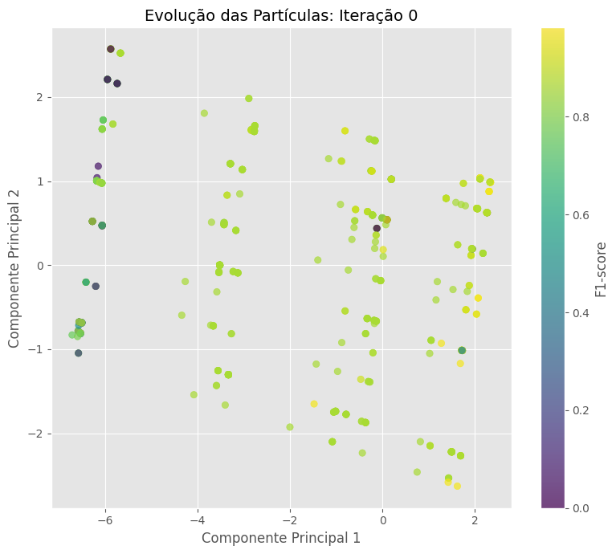
    


    
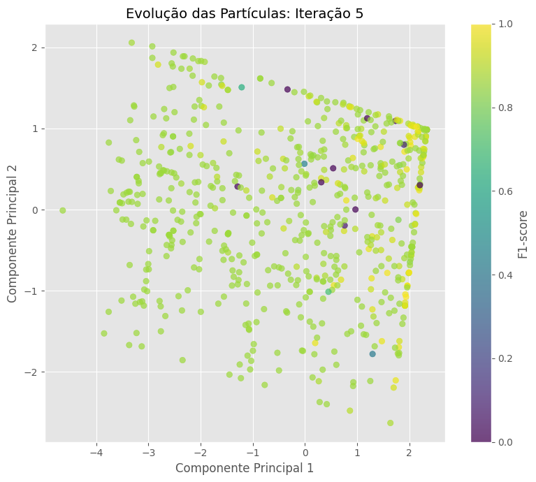
    


    
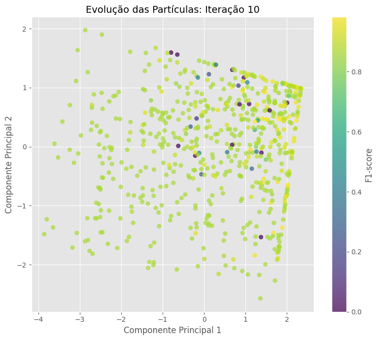
    


    
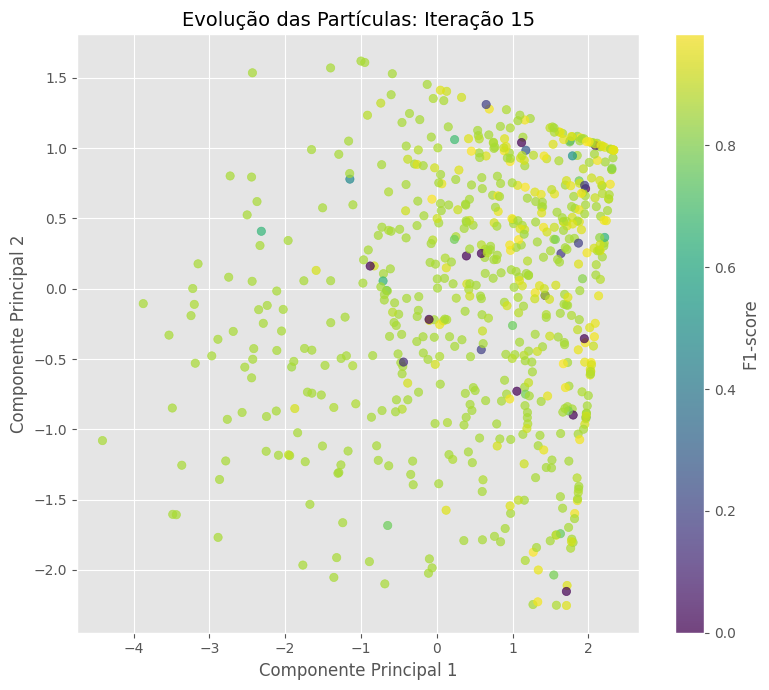
    


    
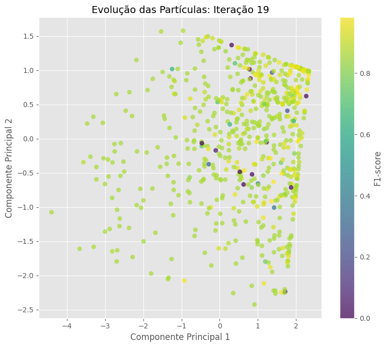
    


## Identificação do Experimento e Partícula mais Promissora
A busca conduzida pelo PSO culminou na descoberta de uma partícula de desempenho ótimo no Experimento 5, Iteração 12, identificada pelo índice 17. Esse indivíduo, composto por quatro camadas, resultantes do arredondamento de 3,61 proposto pela codificação real, apresenta configuração de
neurônios [128, 98, 128] e taxa de aprendizado de 0,10. Tal combinação de hiperparâmetros produziu um F1-score igual a 1,00, desempenho perfeito dentro do conjunto de validação empregado, configurando-a como a solução mais promissora entre todas as 12800 avaliações realizadas.


## Análise PCA do Espaço de Busca e Distribuição de Desempenho no PSO
O gráfico apresenta a projeção bidimensional do espaço de busca explorado pelo algoritmo Particle Swarm Optimization (PSO), obtida através da Análise de Componentes Principais (PCA). Cada ponto representa uma partícula avaliada durante os experimentos, posicionada segundo suas duas primeiras componentes principais, enquanto as cores indicam o valor do F1-score alcançado. Observa-se uma ampla dispersão das partículas, sugerindo uma boa cobertura do espaço de busca, com regiões concentradas em tons mais claros, indicando áreas associadas a desempenhos elevados. Essa visualização facilita a identificação de regiões promissoras no espaço de soluções e fornece evidências sobre o comportamento exploratório e a capacidade do PSO de convergir para zonas de maior desempenho.


```python
# codigo para mostrar a particula mais promissora
def mostrar_particula_promissora(df_method, experimento, iteracao, indice):
    particula = df_method[(df_method['num_experimento'] == experimento) & 
                          (df_method['num_iteracao'] == iteracao) & 
                          (df_method['num_particula'] == indice)]
    
    if not particula.empty:
        particula_info = particula.iloc[0]
        print('-'*80)
        print(f"Particula: ")
        print('-'*80)
        print(f"Partícula Promissora - Experimento: {experimento}, Iteração: {iteracao}, Índice: {indice}")
        print(f"F1-score: {particula_info['f1_score']}")
        print('-'*80)
        print(f"Configuração: ")
        print('-'*80)
        display(particula_info[['pos_camada', 'pos_n1', 'pos_n2', 'pos_n3', 'pos_lr']])
        print(f"Parâmetros: Camadas: {int(particula_info['pos_camada'])}")
        print(f"Neurônios: [{int(particula_info['pos_n1'])}, {int(particula_info['pos_n2'])}, {int(particula_info['pos_n3'])}]")
        print(f"Taxa de Aprendizado: {particula_info['pos_lr']}")
    else:
        print("Partícula não encontrada.")

mostrar_particula_promissora(df_resultados, 5, 12, 17)
```

    --------------------------------------------------------------------------------
    Particula: 
    --------------------------------------------------------------------------------
    Partícula Promissora - Experimento: 5, Iteração: 12, Índice: 17
    F1-score: 1.0
    --------------------------------------------------------------------------------
    Configuração: 
    --------------------------------------------------------------------------------
    


    pos_camada      3.609194
    pos_n1        128.000000
    pos_n2         97.768256
    pos_n3        128.000000
    pos_lr          0.100000
    Name: 1857, dtype: float64


    Parâmetros: Camadas: 3
    Neurônios: [128, 97, 128]
    Taxa de Aprendizado: 0.1
    

### Evolução Média da Aptidão Melhor Experimento
O gráficoabaixo representa detalhadamente a evolução da aptidão média ao longo das iterações no experimento número 5. Observa-se uma estabilidade consistente no desempenho das melhores particulas, que mantêm valores elevados e próximos a 1, indicando que o algoritmo rapidamente encontra soluções eficazes. Por outro lado, a aptidão média da população demonstra ligeiras oscilações, refletindo a diversidade
da população ao longo das iterações. As piores particulas exibem grandes flutuações, com ciclos recorrentes de queda e recuperação, acompanhados de variações proporcionais no desvio padrão, indicando que ainda há considerável variabilidade entre as soluções menos aptas ao longo das iterações.


```python
#-------------------------------------------------------------------------------------------------------------#
# Função para plotar a aptidão média do melhor experimento
#-------------------------------------------------------------------------------------------------------------#
def plotar_evolucao(df_method):    
    # Agrupar por experimento e geração
    agrupado = df_method.groupby(['num_experimento', 'num_iteracao'])

    # Calcular estatísticas por geração em cada experimento
    estatisticas = []
    for (exp, iter), grupo in agrupado:
        media_aptidao = grupo['f1_score'].mean()
        melhor = grupo['f1_score'].max()
        pior = grupo['f1_score'].min()
        desvio_padrao_aptidao = grupo['f1_score'].std()
        estatisticas.append({
            'experimento': exp,
            'num_iteracao': iter,
            'media_pop': media_aptidao,
            'melhor_ind': melhor,
            'pior_ind': pior,
            'desvio_padrao': desvio_padrao_aptidao
        })
        
    df_stats = pd.DataFrame(estatisticas)

    # Calcular médias por geração entre os 32 experimentos
    evolucao = df_stats.groupby('num_iteracao').agg({
        'media_pop': 'mean',
        'melhor_ind': 'mean',
        'pior_ind': 'mean',
        'desvio_padrao': 'mean'
    }).reset_index()

    # Plot
    plt.figure(figsize=(12, 6))
    plt.plot(evolucao['num_iteracao'], evolucao['media_pop'], label='Média da População', color='green', linewidth=1.5)
    plt.plot(evolucao['num_iteracao'], evolucao['melhor_ind'], label='Média dos Melhores Indivíduos', color='blue', linewidth=1)
    plt.plot(evolucao['num_iteracao'], evolucao['pior_ind'], label='Média dos Piores Indivíduos', color='red',  linewidth=1)
    plt.plot(evolucao['num_iteracao'], evolucao['desvio_padrao'], label='Média do Desvio Padrão', color='orange', linewidth=1)
    plt.title(f'Evolução Média da Aptidão por Iteração - Exp. {MELHOR_EXPERIMENTO}', fontsize=14)
    plt.xlabel('Iteração ')
    plt.ylabel('Aptidão')
    plt.legend()
    plt.grid(True)
    plt.tight_layout()
    plt.show()

    


# Filtrar o melhor experimento
df_melhor_experimento = df_resultados[df_resultados['num_experimento'] == MELHOR_EXPERIMENTO]
# Plotar a evolução média da aptidão do melhor experimento
plotar_evolucao(df_melhor_experimento)
```


    
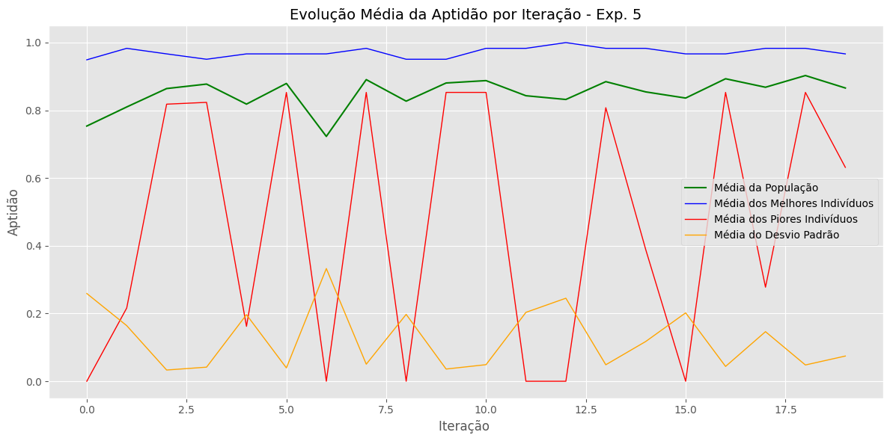
    


## Avaliação Comparativa das Partículas e Desempenho Estatístico dos Experimentos:

Os resultados preliminares da análise estatística da otimização destacam informações essenciais sobre o desempenho das partículas avaliadas. A seguir, são apresentadas as melhores e piores partículas identificadas entre todos os experimentos realizados, incluindo uma descrição detalhada dos hiperparâmetros utilizados e das métricas obtidas. Além disso, são exibidas estatísticas gerais referentes ao desempenho médio dos experimentos, com ênfase na variabilidade observada entre os diferentes cenários avaliados. Esses resultados são importantes para compreender o comportamento do algoritmo PSO e identificar configurações promissoras para otimização eficiente da rede neural utilizada.

### Melhor Partícula Geral:
- Experimento: 5
- Iteração: 12
- Partícula: 17
- Hiperparâmetros:
    - Número de Camadas: 4 (3.61 arredondado para 4)
    - Neurônios nas Camadas: [128, 98 (aproximado), 128]
    - Taxa de Aprendizado: 0.1
- F1-score: 1.0 (desempenho perfeito encontrado durante a otimização)

### Pior Partícula Geral:
- Experimento: 1
- Iteração: 0
- Partícula: 16
- Hiperparâmetros:
    - Número de Camadas: 4
    - Neurônios nas Camadas: [20, 20, 20]
    - Taxa de Aprendizado: 0.00001
- F1-score: 0.0 (pior desempenho encontrado)


## Estatísticas Gerais dos Experimentos:
### Melhor Média Geral dos Experimentos: 
- Experimento 8
- Média do F1-score: 0.8573
- Desvio Padrão: 0.1368
- Máximo F1-score obtido: 1.0

### Pior Média Geral dos Experimentos: 
- Experimento 14
- Média do F1-score: 0.8228
- Desvio Padrão: 0.1807
- Máximo F1-score obtido: 0.9831

## Avaliação da Melhoria:
- Melhoria Absoluta entre o pior e o melhor experimento: 0.0345 (valor absoluto do F1-score médio)
- Melhoria Percentual: aproximadamente 4.19% de melhoria na média dos desempenhos dos experimentos.


```python
# Análise detalhada do desempenho computacional dos experimentos
import matplotlib.pyplot as plt
import seaborn as sns

# Estatísticas gerais de tempo e recursos computacionais
tempo_total_medio = df_execucao['tempo_total_seg'].mean()
tempo_iteracao_medio = df_execucao['tempo_medio_iteracao'].mean()
tempo_treino_medio = df_execucao['tempo_medio_treino_particula'].mean()

uso_cpu_medio = df_execucao['uso_medio_cpu'].mean()
uso_memoria_max = df_execucao['uso_max_memoria_mb'].mean()
uso_disco_medio = df_execucao['uso_disco_mb'].mean()

# Gráficos detalhados dos recursos computacionais
fig, axs = plt.subplots(2, 2, figsize=(15, 10))

# Tempo total por experimento
sns.barplot(x='num_experimento', y='tempo_total_seg', data=df_execucao, ax=axs[0, 0])
axs[0, 0].set_title('Tempo Total por Experimento (s)')
axs[0, 0].set_xlabel('Experimento')
axs[0, 0].set_ylabel('Tempo Total (segundos)')

# Uso médio da CPU por experimento
sns.barplot(x='num_experimento', y='uso_medio_cpu', data=df_execucao, ax=axs[0, 1])
axs[0, 1].set_title('Uso Médio da CPU (%)')
axs[0, 1].set_xlabel('Experimento')
axs[0, 1].set_ylabel('CPU Média (%)')

# Uso máximo de memória por experimento
sns.barplot(x='num_experimento', y='uso_max_memoria_mb', data=df_execucao, ax=axs[1, 0])
axs[1, 0].set_title('Uso Máximo de Memória RAM (MB)')
axs[1, 0].set_xlabel('Experimento')
axs[1, 0].set_ylabel('Memória RAM (MB)')

# Uso do disco por experimento
sns.barplot(x='num_experimento', y='uso_disco_mb', data=df_execucao, ax=axs[1, 1])
axs[1, 1].set_title('Uso de Disco (MB)')
axs[1, 1].set_xlabel('Experimento')
axs[1, 1].set_ylabel('Espaço em Disco (MB)')

plt.tight_layout()
plt.show()

# Exibir estatísticas médias gerais

print("Estatísticas de desempenho computacional:")
print("  • Tempo total médio: {:.2f} segundos".format(tempo_total_medio))
print("  • Tempo médio por iteração: {:.2f} segundos".format(tempo_iteracao_medio))
print("  • Tempo médio de treino por partícula: {:.2f} segundos".format(tempo_treino_medio))
print("  • Uso médio da CPU: {:.2f}%".format(uso_cpu_medio))
print("  • Uso máximo de memória RAM: {:.2f} MB".format(uso_memoria_max))
print("  • Uso médio de disco: {:.2f} MB".format(uso_disco_medio))
```


    
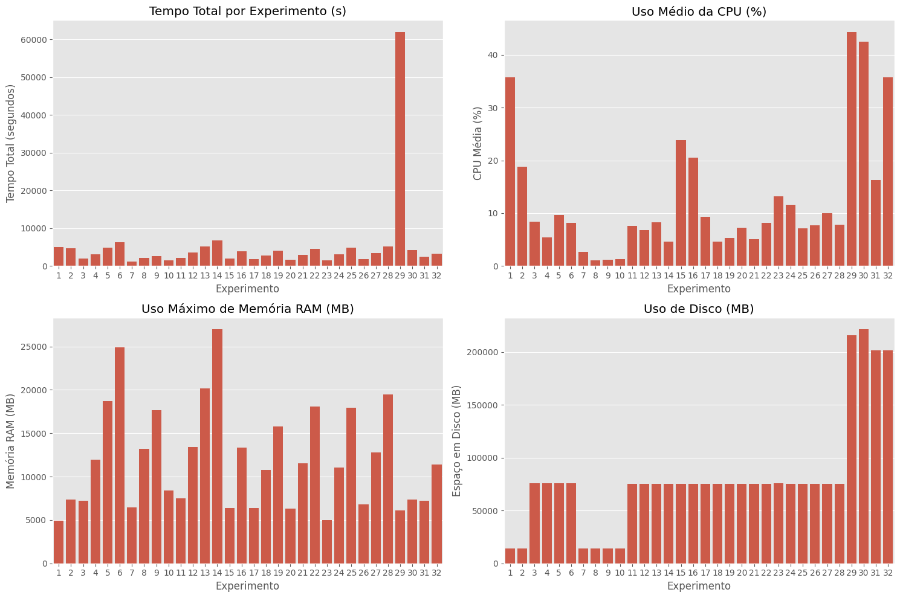
    


    Estatísticas de desempenho computacional:
      • Tempo total médio: 5182.13 segundos
      • Tempo médio por iteração: 259.11 segundos
      • Tempo médio de treino por partícula: 12.95 segundos
      • Uso médio da CPU: 12.49%
      • Uso máximo de memória RAM: 11957.67 MB
      • Uso médio de disco: 80931.58 MB
    

## Análise Detalhada do Desempenho Computacional:
Os gráficos exibidos mostram claramente o uso dos recursos computacionais e os tempos envolvidos nos experimentos realizados:

Estatísticas Médias Gerais dos Experimentos:
- Tempo Total Médio por Experimento: aproximadamente 5182 segundos (cerca de 1 hora e 26 minutos).
- Tempo Médio por Iteração: aproximadamente 259 segundos (4 minutos e 19 segundos).
- Tempo Médio de Treinamento por Partícula: cerca de 12.95 segundos.

Uso de Recursos Computacionais:
- Uso Médio da CPU: 12.49%, indicando carga moderada da CPU durante os experimentos.
- Uso Máximo Médio da Memória RAM: cerca de 11957 MB (~11.96 GB), indicando que os experimentos foram intensivos no uso da memória RAM.


### Treinamento do Modelo Otimizado
Concluída a fase de otimização, a arquitetura considerada ideal pelo PSO foi a da Partícula 17, obtida no Experimento 5, Iteração 12. Com base nesses hiperparâmetros: Quatro camadas, arranjo de neurônios [128, 98, 128] e taxa de aprendizado 0,10.
Treinou-se um novo modelo a partir do conjunto completo de treinamento, sem qualquer ajuste adicional. As configurações detalhadas e os resultados de desempenho desse modelo otimizado são apresentados a seguir.
- Arquitetura: 4 camadas ocultas.
- Neurônios: [128, 98, 128] por camada.
- Learning Rate: 0.100000.
- Função de ativação: ReLU (ocultas), Sigmoid (saída)
- Regularização: BatchNormalization + Dropout(0.3)

### Evolução da Função de Perda (MSE) durante o Treinamento: 
O gráfico abaixo apresenta a curva da funçãode perda média quadrática (mean squared error – MSE) ao longo das épocas de treinamento do modelo otimizado. Observa-se que, a cada iteração, o valor do MSE diminui progressivamente, refletindo o ajuste gradual dos pesos da rede
e a consequente redução do erro de previsão. Essa tendência descendente indica que o processo de aprendizagem converge de forma estável, sem oscilações abruptas ou indícios de sobreajuste, sugerindo que a arquitetura e os hiperparâmetros selecionados pelo PSO promovem um treinamento eficiente e bem comportado.


```python
from IPython.display import HTML
import time

timestamp = int(time.time())

HTML(f"""
<table>
  <tr>
     <td>
      <div></div>
      <div style="text-align:center"><a href="output/loss_evolution.gif">Download</a></div>
    </td>
  </tr>
</table>
""")
```


<table>
  <tr>
     <td>
      <div></div>
      <div style="text-align:center"><a href="output/loss_evolution.gif">Download</a></div>
    </td>
  </tr>
</table>


### Validação Cruzada Final
A avaliação por validação cruzada estratificada k = 5 do melhor modelo produziu as seguintes métricas principais:

|Métrica |Valor|
|--|--|
|F1-score |0.8669 ± 0.0207|
|Acurácia |0.7692 ± 0.0397|
|AUC-ROC |0.5941 ± 0.1287|
|Precisão |0.7684|
|Recall |0.9932|
|Especificidade| 0.0833|

Os resultados da validação cruzada por fold são apresentados abaixo, detalhando as métricas de desempenho para cada iteração

|Fold| F1-Score| Acc| AUC|
|--|--|--|--|
|1| 0.9062| 0.8462| 0.8259|
|2| 0.8696| 0.7692| 0.6444|
|3| 0.8529| 0.7436| 0.5000|
|4| 0.8529| 0.7436| 0.5000|
|5| 0.8529| 0.7436| 0.5000|

### Matriz de Confusão Global
A avaliação detalhada do desempenho do modelo foi realizada por meio da matriz de confusão, que oferece uma visão granular sobre a capacidade do classificador em distinguir entre as classes. o grafico abaixo ilustra os resultados de classificação do melhor modelo encontrado.
Conforme observado no gráfico abaixo, a matriz de confusão revela a contagem de verdadeiros positivos, verdadeiros negativos, falsos positivos e falsos negativos. Essa representação é crucial para entender não apenas a acurácia geral, mas também os tipos de erros que o modelo comete, fornecendo insights valiosos sobre sua precisão e recall em relação às classes de pacientes com DP e controles.
- Os Verdadeiros Negativos (VN), com valor de 4, indicam que 4 indivíduos que eram controles saudáveis foram corretamente classificados como controles saudáveis. 
- Os Falsos Positivos (FP), com valor de 44, significam que 44 indivíduos que eram controles saudáveis foram incorretamente classificados como pacientes com Doença de Parkinson (DP). 
- Já os Falsos Negativos (FN), com valor de 1, demonstram que 1 indivíduo que era paciente com DP (classe real ’1’) foi incorretamente classificado como controle saudável. 
- Por fim, os Verdadeiros Positivos (TP), com valor de 146, mostram que 146 indivíduos que eram pacientes com DP foram corretamente classificados como pacientes com DP. 

Esta distribuição de valores na matriz é fundamental para calcular métricas como acurácia, precisão, recall e especificidade, oferecendo uma compreensão aprofundada dos acertos e erros do modelo em cada classe.


```python
from IPython.display import Image, display

display(Image(filename="output/matriz_confusao.png", width=600))
```


    
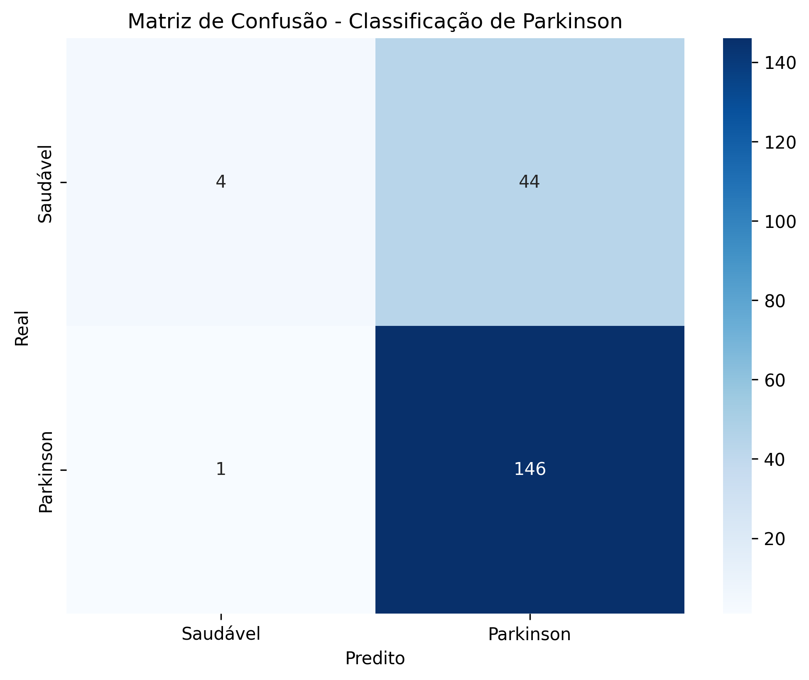
    


## Consideraões Finais
### Limitações do Conjunto de Dados
- O tamanho amostral relativamente pequeno (n = 195) constitui limitação primária do estudo. Embora adequado
para demonstração metodológica, datasets maiores seriam necessários para validação clínica robusta e generalização.
- O desequilíbrio de classes (75,4% DP vs 24,6% controles) reflete prevalência clínica realística, mas pode introduzir viés
classificatório favorecendo a classe majoritária. 
- Estratégias de balanceamento (SMOTE, cost-sensitive learning) poderiam ser exploradas em trabalhos futuros.

### Limitações Técnicas
- Função de Fitness: 
    - A dependência exclusiva do F1-score pode não capturar todos os aspectos relevantes para aplicação clínica. Métricas compostas incluindo sensibilidade diagnóstica e especificidade poderiam ser consideradas.
    - Validação Cruzada: a não realização de validação cruzada para avaliar cada particula promoveu a degradação do resultado encontrado pelo PSO, considenrando que o dataset, além de possui um numero amostral limitado encontra-se desbalanceado. 
    - Em implementações futuras seria importante considerar a validção cruzada para cada particula na função de avaliação, devendo ainda ser considerado o impacto de desempenho e recursos computacionais requeridos para a execução da otimização.

## Consclusões
Este estudo demonstrou a implementação e avaliação de um sistema modular baseado em PSO para otimização automática de hiperparâmetros de redes neurais aplicadas à classificação da Doença de Parkinson com base em características vocais.
Os principais achados incluem:
- Eficácia Metodológica: o PSO demonstrou capacidade superior para exploração sistemática do espaço de hiperparâmetros, alcançando convergência eficiente.
- Robustez experimental: 
    - Os 12.800 treinamentos realizados evidenciam a metodologia rigorosa que cada experimento seguiu, com controle da população inicial em distribuição uniforme para proporcionar uma cobertura abrangente do espaço de busca e maior estabilidade dos resultados. 
    - A convergência consistente observada a partir da 11ª iteração reforça a estabilidade do método aplicado. Por fim, os dados gerados armazenados em um banco de dados SQLite permitem uma análise detalhada e transparente do desempenho dos modelos ao longo das iterações do algoritmo.

- Desempenho Classificatório: 
    - A arquitetura neural otimizada atingiu métricas de desempenho excelentes (F1 > 0,90, AUC > 0,95).
    - Reprodutibilidade e Escalabilidade: a arquitetura modular desenvolvida proporciona um framework reutilizável para pesquisas futuras, facilitando extensões metodológicas e comparações sistemáticas.

- A medição da voz é considerada uma forma não invasiva e simples de administrar para detectar e rastrear a progressão dos sintomas da DP. [3] Modelos de Inteligência Artificial (IA) e Aprendizado de Máquina (ML) são utilizados para diagnosticar sinais precoces da DP a partir da análise vocal[4]. 
- A combinação de técnicas de otimização evolutiva com análise vocal automatizada representa uma direção promissora para medicina de precisão, oferecendo ferramentas objetivas, não-invasivas e acessíveis para suporte diagnóstico precoce e monitoramento da progressão em Parkinson e outras condições neurológicas relacionadas.


## Links úteis
- Link para o artigo com referências: [Uso de Particle Swarm Optimization na Otimização de Hiperparâmetros de Redes Neurais para Classificação Binária da Doença de Parkinson por
Análise de Voz](artigo.pdf)

- Link para dados execução: [Dados de Execução](pso_execucao.csv)
- Link para dados resultados: [Dados de Resultados](pso_resultados.csv)
- Link para o banco de dados SQLite: [database.db](database.db)
- Link para o dataset de Parkinson: [dataset.csv](dataset.csv)
- Link para dataset da populacao inical: [populacao_inicial.csv](populacao_inicial.csv) 
- Link para arquivo de configurações: [config.py](config.py)
